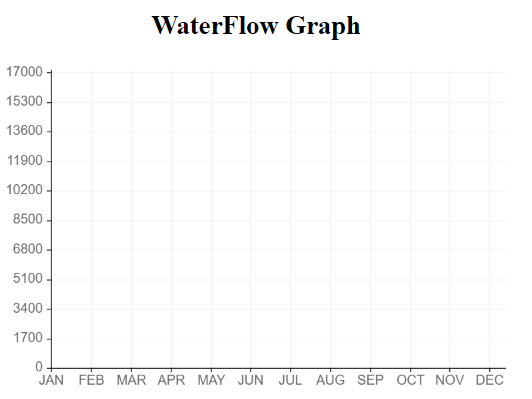

# waterflow-api
### CS 431 - Embedded Systems Course Project

This is an api to access the water flow rate that is received from mbed (LPC1768) board and watermeter sensor.

### Host:
http://waterflow-api.herokuapp.com
### [/line](http://waterflow-api.herokuapp.com/line):

Line graph with latest recevied values  

